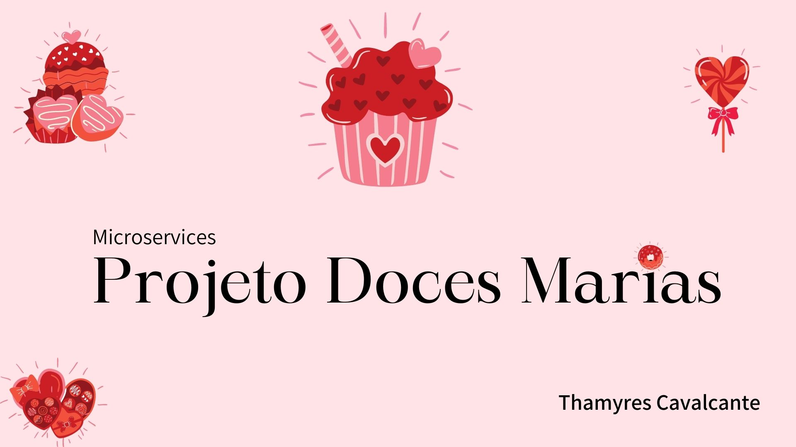

| :placard: Vitrine.Dev |     |
| -------------  | --- |
| :sparkles: Nome        | **Microsserviço - Comunicação Síncrona - Doces Marias**
| :label: Tecnologias | Java, Spring Boot, MySQL, Insomnia, Git, Github
| :rocket: URL         | https://github.com/Thamyresmya/_Microservice-Sincrona-Doces_Marias
| :fire: Desafio     | 

 

 

# Microsserviços Doces Marias

 

  <a href="#-tecnologias">Tecnologias</a>&nbsp;&nbsp;&nbsp;|&nbsp;&nbsp;&nbsp;  
  <a href="#-projeto">Projeto</a>&nbsp;&nbsp;&nbsp;|&nbsp;&nbsp;&nbsp;  
  <a href="#-funcionalidades">Funcionalidades</a>&nbsp;&nbsp;&nbsp;&nbsp;&nbsp;&nbsp;

 

## 🚀 Tecnologias

Esse projeto foi desenvolvido com as seguintes tecnologias:

- Java
- Spring Boot
- MySQL
- insomnia
- Git e Github
- OpenFeign

 

## 💻 Projeto

Projeto desenvolvido durante o curso de Microsserviços implementado com Java e Spring. 

Microsserviço com Java e Spring, conectando a um banco de dados MySQL, implementação do service discovery utilizando o Eureka. Centralização das requisições adicionando um API Gateway. Comunicação síncrona entre dois microsserviços com Open Feign, utilização de circuit breaker e fallback, para prevenir falhas ou inoperabilidade em algum dos microsserviços.

 

## 🔨 Funcionalidades do projeto

Eureka Server:

Gateway:

 

## 📁 Acesso ao projeto

Os códigos podem ser acessados através desse [Link](https://github.com/Thamyresmya/_Microservice-Sincrona-Doces_Marias)

 

Me siga nas redes sociais:
- [Linkedin](https://www.linkedin.com/in/thamyrescavalcante/)
- [Instagran](https://www.instagram.com/thamyres__cavalcante/)

 

---

Feito com ♥ by Thamyres Cavalcante.

